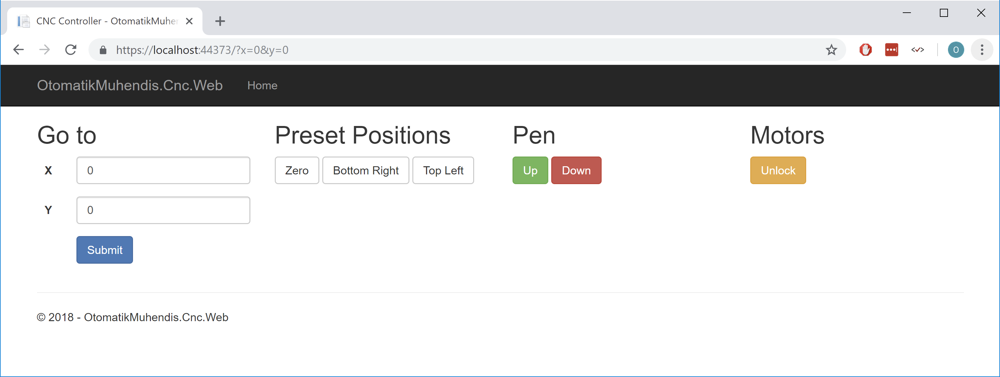

# CNC client

A dotnet core based client library for [CNC Server](https://github.com/techninja/cncserver) with a ASP.NET Core MVC project as a sample.

## Installation

If you follow the installation steps you will have a CNC server running for AxiDraw on your local.

* Install [inkscape-0.91-x64](https://inkscape.org/release/0.91/windows/64-bit/)
* Install [AxiDraw 1.2.2](https://github.com/evil-mad/axidraw/releases/download/v1.2.2/AxiDraw_122_Win.zip)
* `npm install cncserver@2.7.6`
* Go to cncserver-2.7.6\package
* `npm install`
* `npm start`
* Replace botType in config.ini to *axidraw*
* `npm start`

## Running

Now you can run your project. **Attention, if you do not follow those steps you can damage your plotter.**

* Go to project folder
* `dotnet run`
* Click **Unlock** button to unlock motors
* Position plotter head to middle in both coordinates
* Unplug electricity cable to motors
* Click **Zero** button
* Plug back electricity cable to motors
